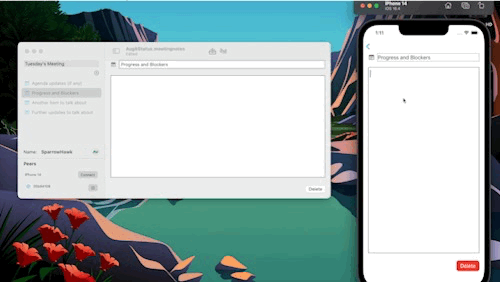

# MeetingNotes

MeetingNotes is an example macOS and iOS app that illustrates using the Automerge-swift library to seamlessly merge document updates and synchronize updates between two running applications over the network.
The app is a multi-platform app, running on either iOS or macOS, and works on iOS v14 and higher, or macOS v11 and higher.

The Automerge-Swift library that powers this multi-platform SwiftUI app is open-source, available on Github at https://github.com/automerge/automerge-swift.
The [source for the MeetingNotes app](https://github.com/automerge/MeetingNotes) is available on GitHub, and [the internal API documentation for the MeetingNotes app](https://automerge.org/MeetingNotes/documentation/meetingnotes/) is also available, including a [Walkthrough of the app](https://automerge.org/MeetingNotes/documentation/meetingnotes/appwalkthrough).

For more information on Automerge, see the [Automerge website](https://automerge.org/), or read the [API documentation for Automerge-swift](https://automerge.org/automerge-swift/documentation/automerge/).

[Screencast clip showing seamless file merging](https://youtu.be/PVYwbVU2Lbk)

## Related documentation

- [The app documentation for MeetingNotes](https://automerge.org/MeetingNotes/documentation/meetingnotes/)
- [API documentation for Automerge-swift](https://automerge.org/automerge-swift/documentation/automerge/)
